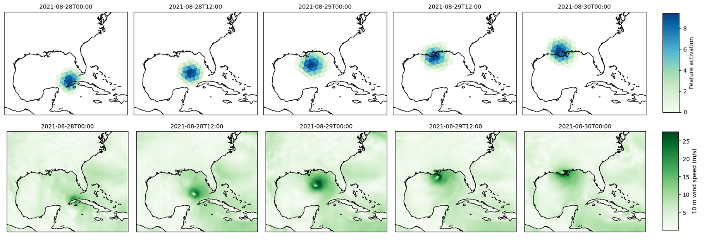
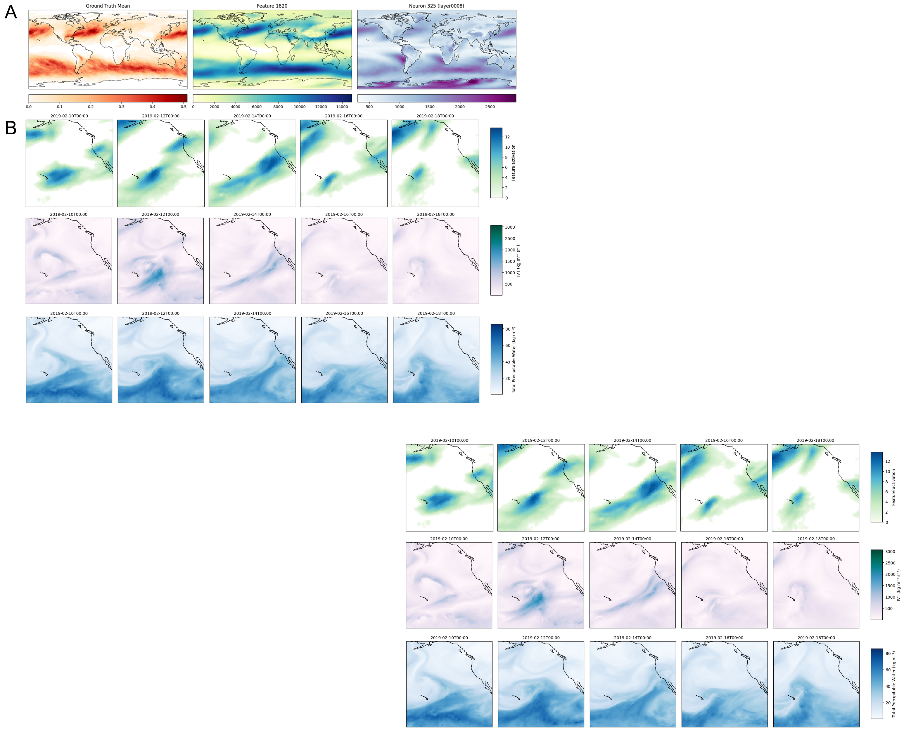

# GraphCast Interpretability

This repository contains code and utilities accompanying the paper:

> **MacMillan, T. & Ouellette, N. T. (2025)**  
> *[Towards mechanistic understanding in a data-driven weather model: internal activations reveal interpretable physical features](https://arxiv.org/abs/2512.24440)
> *(submitted / under review)*

The focus of this codebase is **mechanistic interpretability of DeepMind’s GraphCast weather model**, using sparse autoencoders (SAEs) to identify physically meaningful features in intermediate GraphCast representations.

Some fun features to look at include the hurricane tracking feature

Or the Pineapple express

The primary runnable artifact at present is a **Google Colab notebook** that reproduces a key hurricane case study from the paper. Other components are utilities and scripts used during large-scale analysis on HPC systems. We are working to publish these as well.

---
## Quick start

Click the Colab link below to reproduce a hurricane example from the paper:

[Demo notebook](https://colab.research.google.com/github/theodoremacmillan/graphcast-interpretability/blob/main/hurricane_feature_demo.ipynb) in Colab 

Due to Colab updating their Jax package version, you'll have to switch the runtime version to 2025.07 instead of 'Latest'. It is recommended to run the Colab on an A100 or H100 as the activation steps consume considerable GPU memory.
